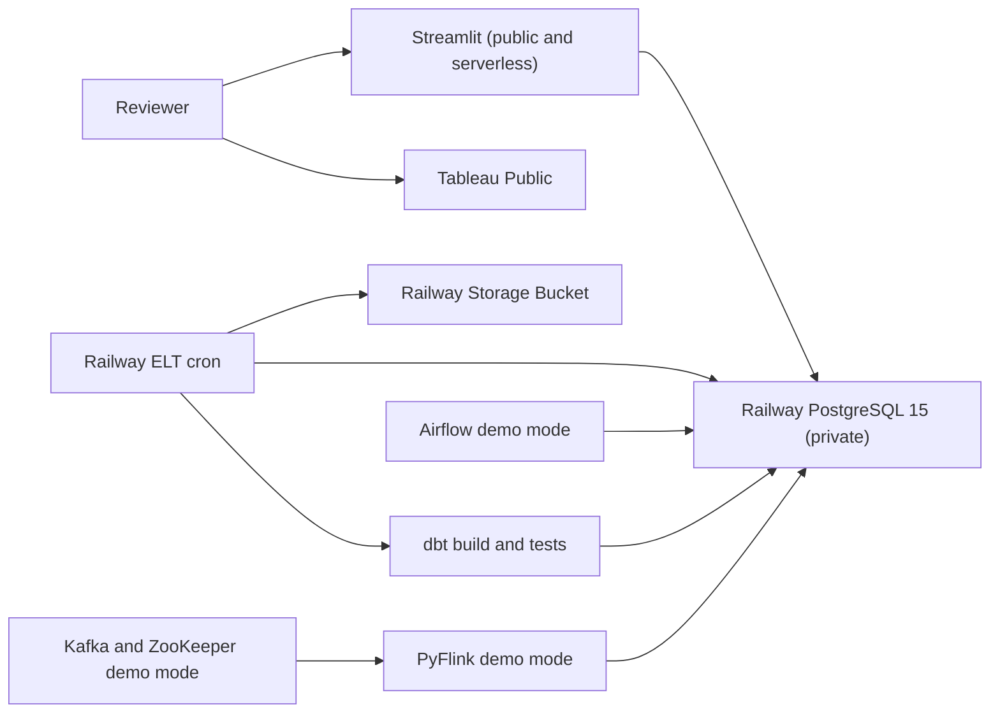

# Insurance Policy Analytics — DE Zoomcamp Course Project

> An end-to-end ELT pipeline that ingests insurance policy, invoice, and claim data into a cloud-hosted data warehouse and powers an interactive Tableau dashboard.

---

## Current Hosting Status

This project was originally designed and deployed on **AWS EC2 + S3**, demonstrating
AWS infrastructure, IAM, networking, container operations, and data-lake integration.
To keep the portfolio available long-term at lower cost, the live deployment was
subsequently migrated completely to **Railway**:

- **Live Streamlit Text-to-SQL:** https://streamlit-production-43ac.up.railway.app
- **Live Tableau dashboard:** [Insurance Policy, Claims & Invoice Analytics](https://public.tableau.com/shared/65BQGNBFS?:display_count=n&:origin=viz_share_link)
- **Current platform:** Railway PostgreSQL 15, Storage Bucket, serverless Streamlit,
  and scheduled ELT/dbt jobs
- **Demonstration mode:** Airflow and Kafka/PyFlink remain deployable on Railway
  for interviews without incurring continuous compute charges
- **Cost rationale:** AWS Cost Explorer showed approximately **US$26.24** for
  August 2026 across EC2 compute, EC2-related storage/networking, VPC, and S3;
  the Railway design targets the Hobby plan's **US$5 monthly usage allowance**

The original AWS architecture, operational documentation, and design decisions are
preserved below. The migration demonstrates a second cloud deployment pattern and
an explicit cost-optimization decision; it does not replace the AWS engineering work.

---

## Problem Statement

An insurance company generates transactional data across three domains — **policies**, **invoices**, and **claims** — but has no unified analytical layer. Business questions such as _"How does premium revenue compare between new and returning customers?"_ or _"Which products have the highest loss ratio?"_ require manual joining across raw tables with inconsistent types and no quality checks.

This project solves that by building a **full ELT pipeline**: raw CSVs are extracted and loaded into a PostgreSQL data warehouse via Python, transformed through a medallion architecture (raw → staging → intermediate → marts) using **dbt**, orchestrated end-to-end by **Apache Airflow**, and deployed on **AWS EC2 + S3**. The result is a set of clean, tested analytical tables that feed a **Tableau dashboard** with key insurance KPIs — no manual data wrangling required.

**AI-assisted exploration:** A **Streamlit** app adds **natural-language Text-to-SQL** over the same dbt **`marts`** (see [AI-assisted analytics (Streamlit)](#ai-assisted-analytics-streamlit) below). The LLM proposes read-only SQL; the app validates and runs it against PostgreSQL. This complements Tableau; it is not a substitute for the dashboard deliverable.

---

## Access for Reviewers

The current public services are Railway Streamlit and Tableau Public. PostgreSQL
remains private on Railway; the application uses a least-privilege, `marts`-only
database role.

| What                    | Where                                                                                                                                                                                           |
| ----------------------- | ----------------------------------------------------------------------------------------------------------------------------------------------------------------------------------------------- |
| Code, SQL, dbt models   | This repo                                                                                                                                                                                       |
| Setup and Tableau notes | [`notes/`](notes/) (setup_guide.md, tableau_summary.md)                                                                                                                                         |
| Current hosting         | Railway — see [`infra/railway/README.md`](infra/railway/README.md)                                                                                                                             |
| Streamlit Text-to-SQL   | **https://streamlit-production-43ac.up.railway.app** — serverless; allow a few seconds for a cold start                                                                                       |
| PostgreSQL warehouse    | Private Railway PostgreSQL 15, database **`insurance_dwh`**; not exposed publicly                                                                                                              |
| Airflow UI              | [Railway on-demand demo](https://airflow-webserver-production-be4b.up.railway.app) — available only after demo mode is enabled; original EC2 UI retired                                         |
| Tableau Public          | [Insurance Policy, Claims & Invoice Analytics](https://public.tableau.com/shared/65BQGNBFS?:display_count=n&:origin=viz_share_link) — no login required to view (4 dashboards as a Story)        |
| Architecture diagrams   | [High-Level](docs/High-Level%20Architecture_drawio_image.png), [ELT Pipeline](<docs/ELT Pipeline (Airflow DAG)_drawio_image.png>), [Data Lineage](docs/Data%20Model%20Lineage_drawio_image.png) |
| Docker & cloud          | Original AWS/local deployment: [`infra/INFRA.md`](infra/INFRA.md); current Railway deployment: [`infra/railway/README.md`](infra/railway/README.md)                                          |

**Reviewer checklist:** (1) Open Tableau. (2) Open Streamlit, allow a few
seconds for its serverless cold start, and run a plain-English question.
(3) Review the preserved AWS architecture and the Railway migration below.
The owner-facing pre-retirement test procedure is
[`infra/railway/ACCEPTANCE_TEST.md`](infra/railway/ACCEPTANCE_TEST.md).

### Historical AWS reviewer endpoints

The original deployment used EC2 Elastic IP **`52.221.114.40`** with Airflow on
**8082**, Streamlit on **8501**, and PostgreSQL on **5432** behind security-group
rules. These endpoints are intentionally retired after the Railway cutover; their
configuration remains documented in [`infra/INFRA.md`](infra/INFRA.md).

---

## Table of Contents

- [Problem Statement](#problem-statement)
- [Access for Reviewers](#access-for-reviewers)
- [Architecture Overview](#architecture-overview)
- [Tech Stack](#tech-stack)
- [Project Structure](#project-structure)
- [Data Sources](#data-sources)
- [Exploratory Data Analysis](#exploratory-data-analysis)
- [Data Ingestion & Orchestration](#data-ingestion--orchestration)
- [Data Warehouse & Data Model](#data-warehouse--data-model)
- [Transformations (dbt)](#transformations-dbt)
- [Dashboard](#dashboard)
- [AI-assisted analytics (Streamlit)](#ai-assisted-analytics-streamlit)
- [Cloud Infrastructure](#cloud-infrastructure)
- [Reproducibility / Getting Started](#reproducibility--getting-started)
- [Notes (plan & thought process)](#notes-plan--thought-process)

---

## Architecture Overview

> Source file: [`docs/architecture.drawio`](docs/architecture.drawio) (editable in [draw.io](https://app.diagrams.net/); exported PNGs below).

### Current Railway architecture



### Original AWS architecture


### Why ELT (not ETL)?

**ELT** (Extract–Load–Transform) has been adopted so that transformations remain inside the warehouse: raw CSVs are loaded into S3 and PostgreSQL's `raw` schema, and dbt then handles staging, intermediate, and marts in SQL. A single source of truth is preserved, and business logic can be changed and re-run without modifying the load step.

---

## Tech Stack

| Layer            | Tool                                   | Purpose                                                          |
| ---------------- | -------------------------------------- | ---------------------------------------------------------------- |
| Language         | Python 3.10+                           | Scripting, EL tasks, Airflow DAGs                                |
| SQL              | PostgreSQL 15                          | Warehouse queries, dbt backend                                   |
| Transformations  | dbt Core + dbt-postgres                | Medallion architecture (raw → staging → intermediate → marts)    |
| Orchestration    | Apache Airflow 2.x + BashOperator       | Centralized scheduling and dbt workflow automation               |
| Stream processing | Apache Flink (PyFlink) + Kafka        | Event stream → `raw_streaming.stream_policy_events` ([`streaming/`](streaming/)) |
| Dashboard        | Tableau Public                         | Interactive analytics dashboard (public URL)                     |
| Ad hoc analytics | Streamlit + OpenRouter                 | Optional Text-to-SQL over `marts` ([`streamlit_app/`](streamlit_app/)) |
| Containerization | Docker + Docker Compose                | Reproducible deployment (Airflow + PostgreSQL + dbt)             |
| Cloud            | Railway; originally AWS EC2 + S3       | Current hosting plus preserved original cloud architecture       |
| Version Control  | Git + GitHub                           | Source control                                                   |
| Secrets          | Railway service variables / local `.env` | Hosted secrets remain in Railway; `.env` is for local use only  |

---

## Project Structure

```
final_project/
├── README.md                            # This file — project overview & setup
├── .gitignore
├── requirements.txt
│
├── data/                                # Raw CSVs (gitignored)
│   ├── policy.csv
│   ├── invoice.csv
│   └── claim.csv
│
├── notebooks/                           # Exploratory Data Analysis
│   └── eda_summary.ipynb
│
├── notes/                               # Plan & thought process (shared with reviewers)
│   ├── setup_guide.md                   # Phase-by-phase setup and build order
│   └── tableau_summary.md               # Tableau workbook structure and data sources
│
├── docs/                                # Architecture diagrams
│   └── architecture.drawio
│
├── dbt_project/                         # dbt transformations
│   ├── dbt_project.yml
│   ├── profiles.yml
│   ├── packages.yml
│   ├── models/
│   │   ├── staging/                     # Bronze → Silver (clean + type cast)
│   │   ├── intermediate/                # Business logic layer
│   │   └── marts/                       # Gold (analytical models)
│   ├── tests/
│   └── macros/
│
├── airflow/                             # Orchestration
│   ├── dags/
│   │   └── insurance_elt_pipeline.py
│   └── plugins/
│
├── dashboard/                           # Analytics Dashboard (Tableau)
│   └── README.md                        # Public URL + screenshots
│
├── streamlit_app/                       # Optional Text-to-SQL UI (OpenRouter + marts)
│   ├── app.py
│   └── README.md
│
├── infra/                               # Docker & Cloud deployment
│   ├── docker-compose.yml
│   ├── Dockerfile
│   ├── Dockerfile.streamlit
│   ├── streamlit-requirements.txt
│   ├── .env.example
│   ├── INFRA.md                         # Local Docker + cloud architecture
│   ├── scripts/
│   │   ├── init_warehouse.sql
│   │   └── add_raw_streaming.sql        # One-off migration if warehouse already existed
│   └── ...
│
├── streaming/                           # PyFlink: Kafka → Postgres stream landing zone
│   ├── README.md
│   ├── job.py
│   ├── producer.py
│   ├── Dockerfile
│   └── Dockerfile.producer
│
└── scripts/                             # Python EL scripts
    ├── extract_load.py                  # CSV → S3 → PostgreSQL (raw schema)
    └── upload_to_s3.py                  # Upload local CSVs to S3
```

---

## Data Sources

Three CSVs: policy (~6.6k rows), invoice (~9.6k), claim (~792). They link on `policy_number`; `user_id` in policy is the customer (one user can have many policies). Details in the EDA notebook.

---

## Exploratory Data Analysis

EDA was conducted in [`notebooks/eda_summary.ipynb`](notebooks/eda_summary.ipynb) before SQL or dbt so that model design would match the data.

Key findings: 6,583 policies (9 product types, 166 users; outpatient dominates). One user holds 5,380 policies and is treated as an outlier (excluded in staging). Invoices and claims link on `policy_number`; two orphan invoices are handled via referential checks in dbt. New vs returning is defined using `ROW_NUMBER()` over `effective_date` per user. These findings inform staging logic, null handling, and analytical definitions.

---

## Data Ingestion & Orchestration

A single Airflow DAG (`insurance_elt_pipeline`) runs the full ELT flow end-to-end:

1. **Extract & Load** — a Python script (`scripts/extract_load.py`) reads CSVs from S3 (or local `data/`) and loads them into PostgreSQL's `raw` schema.
2. **Transform** — `dbt run` builds the staging → intermediate → marts layers.
3. **Test** — `dbt test` validates data quality (not-null, unique, referential integrity).

The DAG uses explicit Airflow `BashOperator` tasks for ingestion, `dbt run`, and
`dbt test`, preserving a simple and inspectable three-stage dependency chain.

_drawio_image.png>)

### Streaming path (PyFlink + Kafka)

In parallel with the **batch** DAG above, a small **stream ingestion** leg runs in the same Docker Compose stack:

1. **`event-producer`** publishes JSON events to Kafka topic `policy_events`.
2. **`flink-streaming`** runs a **PyFlink** job (DataStream API: `FlinkKafkaConsumer` + `JdbcSink`) that reads from Kafka and writes rows into **`raw_streaming.stream_policy_events`**.

This does **not** replace the CSV → S3 → `raw` load or existing dbt models; it is a **stream landing zone** for course/streaming criteria. A future dbt iteration could add `staging` models from `raw_streaming` (see [`streaming/README.md`](streaming/README.md)).

---

## Data Warehouse & Data Model

The data warehouse uses a **medallion layout** in PostgreSQL: `raw` (load as-is), then `staging` (clean and type), `intermediate` (business logic), and `marts` (reporting). Tables are organized into **separate schemas** matching each layer for clear isolation.

| Layer      | Schema         | What's in it                                                                                     |
| ---------- | -------------- | ------------------------------------------------------------------------------------------------ |
| **Bronze** | `raw`          | `raw_policy`, `raw_invoice`, `raw_claim`                                                         |
| **Bronze** | `raw_streaming` | `stream_policy_events` (append-only events from PyFlink; not used by current dbt marts)         |
| **Silver** | `staging`      | `stg_policy`, `stg_invoice`, `stg_claim`                                                         |
| **Silver** | `intermediate` | `int_policy_ranked`, `int_invoice_paid`                                                          |
| **Gold**   | `marts`        | New vs returning, denormalized policy, and dashboard marts (daily, rollups, monthly, by product) |


---

## Transformations (dbt)

All transformations are defined in **dbt Core** with the `dbt-postgres` adapter, following the medallion architecture:

- **Staging models** (`stg_policy`, `stg_invoice`, `stg_claim`): clean column names, cast types, filter outliers, add referential checks.
- **Intermediate models** (`int_policy_ranked`, `int_invoice_paid`): business logic such as identifying new vs returning customers via `ROW_NUMBER()` and filtering to paid invoices.
- **Mart models**: analytical tables consumed by the dashboard — `mart_new_vs_returning_premium`, `mart_policy_denormalized`, `mart_dashboard_daily`, `mart_dashboard_monthly`, `mart_dashboard_rollups`, `mart_dashboard_by_product`.

dbt tests enforce not-null, uniqueness, accepted values, and referential integrity. A custom macro (`generate_schema_name`) routes models to the correct PostgreSQL schema.

---

## Dashboard

**[Live Dashboard →](https://public.tableau.com/shared/65BQGNBFS?:display_count=n&:origin=viz_share_link)**

A Tableau Story with **4 interactive dashboards**:

| Dashboard                     | What it shows                                                                                                              |
| ----------------------------- | -------------------------------------------------------------------------------------------------------------------------- |
| **Performance Dashboard**     | KPIs, monthly premium vs claims trend, product breakdown, loss ratio, new vs returning, policies issued                    |
| **Executive Summary**         | Quarterly & annual performance table with YoY % growth                                                                     |
| **Claims Analysis**           | Billed vs payable, coverage ratio, claim rate & frequency, out-of-pocket, top costliest policies, profitability by product |
| **Customer & Policy Profile** | Age distribution, premium & loss ratio by age group, revenue per invoice, product × gender heatmap                         |

Metrics are pre-computed in dbt marts so the dashboard uses `mart_dashboard_monthly`, `mart_dashboard_rollups`, `mart_dashboard_by_product`, `mart_new_vs_returning_premium`, and `mart_policy_denormalized` without heavy calculated fields. Details in [dashboard/README.md](dashboard/README.md).

See [AI-assisted analytics (Streamlit)](#ai-assisted-analytics-streamlit) for how the AI layer works and how to run it.

---

## AI-assisted analytics (Streamlit)

This project includes an optional **Streamlit** web app that uses a **large language model via [OpenRouter](https://openrouter.ai/)** to turn **plain-English questions** into **SQL**, then executes that SQL as **read-only** queries against the **`marts`** schema (the same dbt models that feed Tableau).

**How it works (end-to-end):**

1. The reviewer types a question (for example, “top policies by claim amount in 2020”).
2. The app sends the question plus a **fixed schema description** of the `marts` tables to OpenRouter; the model returns a single **SELECT** (or **WITH … SELECT**) statement.
3. The app **rejects** non-read-only SQL (no `INSERT`, `UPDATE`, `DROP`, etc.), ensures a **row limit** (default cap **200**), and runs the query against the warehouse using **SQLAlchemy**.
4. Results appear as a table in the browser.

**Deployment:** On EC2, the **`streamlit`** service in [`infra/docker-compose.yml`](infra/docker-compose.yml) listens on **port 8501** and connects to the **`warehouse`** container on the Docker network. The server’s root **`.env`** must include **`OPENROUTER_API_KEY`** (and optionally **`OPENROUTER_MODEL`** — use an exact slug from [openrouter.ai/models](https://openrouter.ai/models), e.g. `qwen/qwen3.5-flash-02-23` without a trailing typo). Reviewers only need the public URL; they do **not** receive an OpenRouter key.

**Local use:** From `final_project`, install [`requirements.txt`](requirements.txt), configure `.env`, and run `streamlit run streamlit_app/app.py` (see [streamlit_app/README.md](streamlit_app/README.md)).

---

## Cloud Infrastructure

### Current Railway hosting

The cost-optimized live deployment uses one private PostgreSQL 15 service, a
private S3-compatible Railway Storage Bucket, serverless Streamlit, a weekly
terminating ELT/dbt cron service, and a monthly logical-backup job. Airflow and
Kafka/PyFlink use immutable Railway-ready images but run only for demonstrations.
The live Streamlit service stores `OPENROUTER_API_KEY` as a Railway service
variable rather than in the repository.
See [`infra/railway/README.md`](infra/railway/README.md).

### Original AWS hosting

The original full-time deployment ran on **AWS**:

| Service            | Role                                                                         |
| ------------------ | ---------------------------------------------------------------------------- |
| **S3**             | Data lake — raw CSVs stored under `raw/` prefix                              |
| **EC2** (t3.small or larger) | Hosts Airflow, PostgreSQL (warehouse + metadata), dbt, Streamlit, and optional Kafka + PyFlink via Docker Compose (see [`infra/INFRA.md`](infra/INFRA.md) for sizing) |

The same `docker-compose.yml` used locally ran on EC2. Security, reliability,
storage sizing, IAM, and networking are documented in [`infra/INFRA.md`](infra/INFRA.md).
The move to Railway eliminates the continuing EC2, EBS, Elastic IP, and S3 costs
while preserving the AWS implementation as a reproducible architecture.

---

## Reproducibility / Getting Started

Local setup requires Python 3.10+, PostgreSQL 15, Docker Compose, dbt-core + dbt-postgres, and AWS CLI when using S3/EC2.

**Local run (no Docker):** Clone the repo, run `pip install -r requirements.txt`, copy `infra/.env.example` to `.env` and set Postgres (and AWS if needed). Then run `python scripts/extract_load.py` and from `dbt_project`: `dbt deps`, `dbt run`, `dbt test`.

**Full pipeline (Docker):** From the repo root, `cd infra` and `docker compose --env-file ../.env build` (first time builds Airflow, Streamlit, **event-producer**, and **flink-streaming**), then `docker compose --env-file ../.env up -d` (so root `.env` is loaded). On first run the init container creates the Airflow DB and admin user; after ~30–60 seconds the UI is available at http://localhost:8082 (login `admin` / `admin`). The `insurance_elt_pipeline` DAG runs the full ELT when triggered. **Streaming:** Kafka starts on **9092**; PyFlink writes to `raw_streaming.stream_policy_events`. If your **warehouse** data volume was created before that schema existed, run `infra/scripts/add_raw_streaming.sql` once (see [`streaming/README.md`](streaming/README.md)).

**Railway:** The current hosted deployment, required variables, service mapping,
cron schedules, backup process, and on-demand Airflow/streaming runbook are in
[`infra/railway/README.md`](infra/railway/README.md).

**S3 (pipeline reads CSVs from S3):** Create a bucket, set `S3_BUCKET_NAME` in `.env`, then run `python scripts/upload_to_s3.py` from the repo root to upload `data/*.csv` under `raw/`. See [infra/S3_SETUP.md](infra/S3_SETUP.md).

**Streamlit Text-to-SQL:** On EC2, use Docker Compose (includes a **`streamlit`** service on port **8501**). Put `OPENROUTER_API_KEY` (and optionally `OPENROUTER_MODEL`) in `final_project/.env`, ensure **`POSTGRES_HOST=warehouse`** on the server for Airflow/warehouse wiring, open **8501** in the security group, then `cd infra && docker compose --env-file ../.env up -d`. Reviewers: **`http://<Elastic-IP>:8501`**. For a quick run on your laptop without Docker, see [streamlit_app/README.md](streamlit_app/README.md) (`POSTGRES_HOST=localhost` when port 5432 is published).

---

## Notes (plan & thought process)

The [`notes/`](notes/) folder is included so that build order and decisions are visible to reviewers:

| File                                           | Content                                                                   |
| ---------------------------------------------- | ------------------------------------------------------------------------- |
| [setup_guide.md](notes/setup_guide.md)         | Phase-by-phase setup (PostgreSQL, S3, dbt, Airflow, EC2) and build order. |
| [tableau_summary.md](notes/tableau_summary.md) | Workbook structure, marts used per sheet, and metrics.                    |
